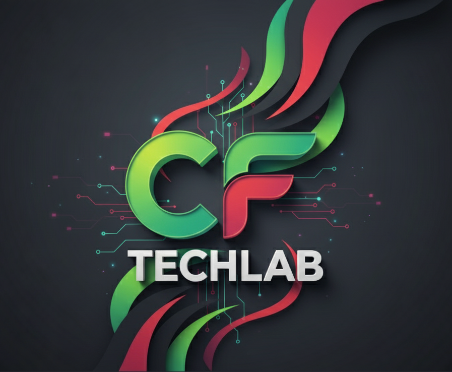

<div align="center">

<br/>



<h1>⚡ CF TechLab</h1>

<p><strong>Where creativity meets intelligent engineering.</strong><br/>Modern innovation & creative tooling platform powered by <em>React • Vite • Tailwind • Supabase • Edge Functions</em>.</p>

<p>


</p>

<sub>Design • Automation • AR/VR • AI • Creative Intelligence</sub>

<br/>

</div>

---

> **TL;DR**: Static frontend + Supabase (DB/Storage) + one Edge Function for emails. No monolithic backend. Lean, fast, extensible.

---

## 🧭 Table of Contents

- [✨ Vision](#-vision)
- [🚀 Core Features](#-core-features-current)
- [🧱 Architecture Snapshot](#-architecture-snapshot)
- [🎨 Design Principles](#-design-principles)
- [🛠 Tech Stack](#-tech-stack)
- [📁 Directory Overview](#-directory-overview)
- [⚙️ Environment](#️-environment-variables)
- [🧪 Quick Start](#-quick-start-local)
- [☁️ Deployment](#️-deployment-vercel--supabase)
- [📬 Notifications Flow](#-notifications-flow)
- [🧵 React Query Integration](#-react-query-integration)
- [🔐 Security / RLS](#-security--rls-status)
- [🧪 Quality & Tooling](#-quality--tooling)
- [🧰 Useful Scripts](#-useful-scripts)
- [🎨 Brand Palette](#-brand-palette)
- [🗺 Roadmap](#-roadmap)
- [🤝 Contributing](#-contributing)
- [📄 License](#-license)
- [🧑‍💻 Maintainer](#-maintainer--contact)

---

---

## ✨ Vision

CF TechLab is a lean, fast-loading marketing & product showcase platform for AI, design tooling, AR/VR & automation solutions. The legacy Node/Prisma backend was intentionally removed to simplify first release — we now run fully serverless: **Static Frontend + Supabase (DB/Storage/Auth) + Edge Function for notifications**.

---

## 🚀 Core Features (Current)

| Area | Capability |
|------|------------|
| Landing & Sections | Hero, Services, Projects, Testimonials, FAQ, CTA, Contact |
| Dynamic Data | Services, Projects, Testimonials, Contact Messages stored in Supabase tables |
| Media | Public object storage (bucket `uploads`) for project & testimonial images |
| Forms | Contact, Testimonial submission, Service Request (simulated local fallback) |
| Admin Pages | Add Project, Moderate Testimonials (approve / delete) |
| Notifications | Edge Function `notify` triggers owner + (optional) user acknowledgment email via Resend |
| React Query | Unified data & mutation layer (`hooks/useData.ts`, `hooks/useMutations.ts`) |
| Theming Surface | Tailwind design tokens & gradients ready for dark/light extension |

Planned next (see Roadmap): Auth, granular RLS, richer email templates, rate limiting, analytics.

---

## 🧱 Architecture Snapshot

```
┌─────────────────────────────────────────────┐
│            React + Vite (Static)            │
│  UI Components • Forms • Admin Mini-Panels  │
└───────────────┬─────────────────────────────┘
		│ React Query (fetch / mutate)
		▼
	Supabase REST / PostgREST
	Tables: services, projects,
		 testimonials, contact_messages
		│
		│ Storage (bucket: uploads)
		▼
	Public Media URLs (CDN cached)
		│
		│ invoke / fallback fetch
		▼
  Edge Function (notify) ──► Resend API (emails)
```

- **Zero monolith** → Lower operational burden.
- **Supabase = Headless CMS** (temporary open RLS for speed; will lock down).
- **Edge Function** handles notification dispatch + CORS.

---

## 🎨 Design Principles

| Principle | Why It Matters | Practical Expression |
|-----------|----------------|----------------------|
| Lean First | Faster iteration, fewer moving parts | Removed legacy server, single function for mail |
| Progressive Hardening | Ship value early, secure steadily | Open RLS in dev → planned policy set |
| User Feedback Loops | Instant acknowledgement builds trust | Dual owner + user email (where allowed) |
| Declarative Data | Clarity + maintainability | React Query + typed hooks in `hooks/` |
| Visual Narrative | Brand consistency & energy | Gradient layers, animated cards, iconography |

---

---

## 🛠 Tech Stack

| Layer | Tech |
|-------|------|
| UI | React 18, TypeScript, Tailwind CSS, Radix Primitives (shadcn‑style) |
| State/Data | TanStack React Query 5 |
| Backend as a Service | Supabase (Postgres + Storage + Edge Functions) |
| Notifications | Resend (via Edge Function) – pluggable design |
| Tooling | Vite, ESLint, SWC, Scripts (bash) |

---

## 📁 Directory Overview

```
CF_TechLab/
	src/
		components/         # UI sections & primitives
		hooks/              # Data + mutation hooks (React Query)
		lib/                # supabase, notify, api helpers, utils
		pages/              # Route-level pages (Admin, About, etc.)
	supabase/
		functions/notify/   # Edge email notification function (Deno)
	scripts/              # Automation & RLS helper scripts
	public/               # Static assets
	.env.example          # Frontend env template
	vercel.json           # Static SPA config
```

---

## ⚙️ Environment Variables

Copy `.env.example` → `.env.local` (never commit real values):

```
VITE_SUPABASE_URL=https://<project-ref>.supabase.co
VITE_SUPABASE_ANON_KEY=<public-anon-key>
VITE_SUPABASE_BUCKET=uploads
VITE_NOTIFICATIONS_ENABLED=true
VITE_SIMULATE_SERVICE_REQUESTS=true
```

Edge Function & secrets (set via CLI, NOT in `.env.local`):

```
supabase secrets set \
	RESEND_API_KEY=... \
	NOTIFY_FROM="CF TechLab <no-reply@domain.com>" \
	NOTIFY_TO="owner@domain.com,team@domain.com" \
	SEND_USER_ACK=true \
	BRAND_NAME="CF TechLab" \
	ACK_SUBJECT_PREFIX="Thanks from CF TechLab"
```

> Sandbox limitation: Resend may send only to verified or primary addresses until domain verified.

---

## 🧪 Quick Start (Local)

```bash
git clone https://github.com/hcsarker/CF_TechLab.git
cd CF_TechLab
cp .env.example .env.local   # fill in Supabase keys
npm install
npm run dev                  # http://localhost:8080
```

Run Edge Function locally (optional):

```bash
supabase login
supabase link --project-ref <project-ref>
supabase functions serve --env-file .env.local
# POST → http://localhost:54321/functions/v1/notify
```

Production build:

```bash
npm run build
npm run preview
```

---

## ☁️ Deployment (Vercel + Supabase)

1. Push repo to GitHub.
2. Create Vercel project → Framework: Vite.
3. Add frontend env vars (the `VITE_*` ones) in Vercel dashboard.
4. Deploy – static output served from `dist/` (configured via `vercel.json`).
5. Deploy Edge Function:
	 ```bash
	 supabase functions deploy notify
	 ```
6. Set secrets (see earlier section) & test:
	 ```bash
	 curl -s -X POST \
		 -H "Content-Type: application/json" \
		 -H "Authorization: Bearer $VITE_SUPABASE_ANON_KEY" \
		 https://<project-ref>.functions.supabase.co/notify \
		 -d '{"type":"contact","id":"test","meta":{"name":"Demo","email":"demo@example.com"}}'
	 ```

SPA fallback is handled by `vercel.json` routes – no custom server needed.

---

## 📬 Notifications Flow

Frontend triggers `sendNotification(payload)` after successful mutations (contact, testimonial, project, service-request). Sequence:

1. Attempt `supabase.functions.invoke('notify')`
2. Fallback direct `https://<functions-subdomain>/notify`
3. Edge Function sends owner email; optionally user acknowledgment if `SEND_USER_ACK=true` & `meta.email` present.
4. Response includes `{ ok: true, ackStatus, ackError }` for diagnostics.

Extend provider: adjust `supabase/functions/notify/index.ts` (Resend → SMTP, Postmark, etc.).

---

## 🧵 React Query Integration

- Data hooks: `hooks/useData.ts` (services, featured projects, paginated projects, testimonials).
- Mutation hooks: `hooks/useMutations.ts` (submit testimonial, create project, approve/delete testimonial, submit contact message) – each posts to Supabase tables + triggers notification.
- Storage uploads: project & testimonial images uploaded to bucket, then stored as public URLs.

---

## 🔐 Security / RLS Status

Current dev configuration is permissive for velocity:

- RLS disabled / open policies for demo (script: `scripts/drop-all-rls-and-policies.sql`).
- BEFORE production: re‑enable RLS and craft policies (e.g., allow anonymous INSERT with validation, restrict SELECT of sensitive tables like contact messages to service role or admin auth).
- NEVER expose `service_role` key to the browser.

Recommended hardening tasks:
1. Re-enable RLS on all tables.
2. Create separate table or flag for admin users (Supabase auth).
3. Add rate limiting (Edge Function) for contact/testimonial spam.
4. Switch email provider to verified domain; add SPF/DKIM.
5. Log function invocations (Supabase logs) & add error alerts.

---

## 🧪 Quality & Tooling

| Command | Purpose |
|---------|---------|
| `npm run dev` | Start Vite dev server |
| `npm run build` | Production build (outputs `dist/`) |
| `npm run preview` | Preview built assets |
| `npm run lint` | ESLint code quality check |
| `supabase functions deploy notify` | Deploy email function |
| `./scripts/supabase-setup-notify.sh` | Automate secrets + deploy + test |

Add tests (Jest / Vitest) in future milestone.

---

## 🧰 Useful Scripts

---

## 🎨 Brand Palette

| Color | Hex | Usage |
|-------|-----|-------|
| Neon Green | `#00FF99` | Accent energy / highlights |
| Rebel Red | `#FF2E63` | Callouts / emphasis |
| Deep Black | `#1A1A1A` | Base canvas |
| Pure White | `#FFFFFF` | Contrast / typography |
| Soft Glow | `rgba(0,255,153,0.12)` | Background aura |

<p>
<span style="background:#00FF99;padding:4px 10px;border-radius:4px;font-size:12px;">#00FF99</span>
<span style="background:#FF2E63;padding:4px 10px;border-radius:4px;font-size:12px;">#FF2E63</span>
<span style="background:#1A1A1A;color:white;padding:4px 10px;border-radius:4px;font-size:12px;">#1A1A1A</span>
<span style="background:#FFFFFF;padding:4px 10px;border:1px solid #ddd;border-radius:4px;font-size:12px;">#FFFFFF</span>
</p>

| Script | Description |
|--------|-------------|
| `scripts/supabase-setup-notify.sh` | Non‑interactive secrets + deploy + test call |
| `scripts/setup-notifications.md` | Narrative setup guide |
| `scripts/drop-all-rls-and-policies.sql` | Dev-only: drops policies & opens data (DO NOT use in prod) |

---

## 🗺 Roadmap

| Phase | Focus |
|-------|-------|
| 1 | Implement proper RLS policies & auth guard for admin pages |
| 2 | Rich email templates + Gmail/SMTP fallback + analytics events |
| 3 | Rate limit + CAPTCHA / hCaptcha integration on public forms |
| 4 | CI pipeline (lint, type check, deploy preview) |
| 5 | Content editor / minimal CMS UI |
| 6 | Observability (error tracking, performance metrics) |

---

## 🤝 Contributing

Contributions welcome! Until auth & RLS are reinstated, most work will focus on frontend polish + security hardening. Open an issue describing the enhancement before submitting a PR.

Guidelines:
1. Fork → branch (`feat/<short-description>`)
2. Keep changes scoped & atomic
3. Run lint + build before PR
4. Add doc updates if behavior changes

---

## 📄 License

MIT © 2025 CF TechLab

---

## 🧑‍💻 Maintainer / Contact

- Project Owner: @hcsarker
- Issues: GitHub Issue Tracker
- Email: (via site contact form – triggers Edge Function)

---

<div align="center" style="margin-top:40px;">

### 🌠 CF TechLab

<em>Crafting intelligent creative tools & immersive experiences.</em><br/>
Made with ⚡, TypeScript & curiosity.

<br/>

`build fast` · `learn faster` · `secure next`

</div>

